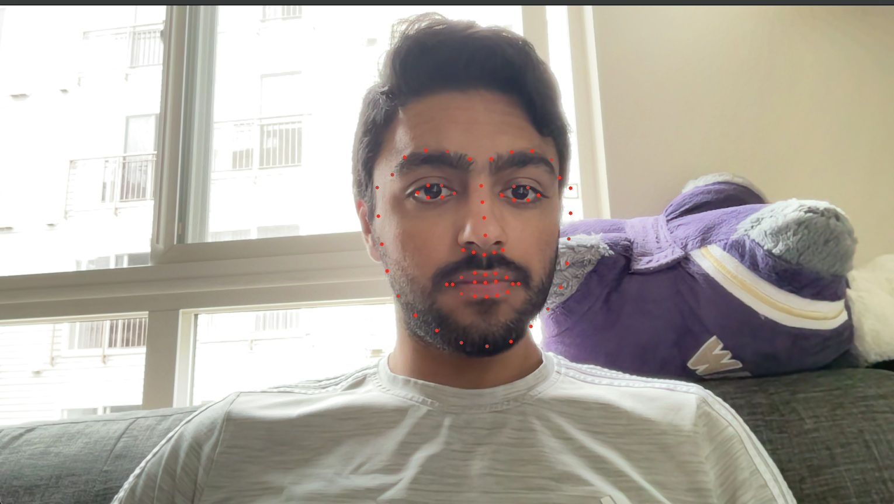

# Creating an extensible framework to apply facial filters in real time (CSE455 Final Project - Guramrit Singh)

## Video Summary

<iframe width="560" height="315" src="https://www.youtube.com/embed/OjgqeOV3e28" title="YouTube video player" frameborder="0" allow="accelerometer; autoplay; clipboard-write; encrypted-media; gyroscope; picture-in-picture" allowfullscreen></iframe>

## 1. Introduction

As social media platforms have grown, we have been seeing a larger amount of content being created directly from the in-app camera features of the respective apps. More often than not these in-built camera interfaces have proprietary features like facial filters. These processes are heavily guared including the algorithms and the filters themselves. (Recall, the infamous of the Snapchat "Dog" filter from about three years ago). There is however, not a good utility that exists the users can use to create and perfect their own filters.

Thus, the goal of my project was to study real-time filter application techniques and impelement these techniques in an extensible filter framework that is easy to extend and allows users to create facial filters in minutes and off of virtually any png image with the filter cropped out. For this case I chose to use PNG images due to their ability to store transparency information. The idea is that the user of the program simple downloads an image, tags the important points that they want to track to their face, and be able to use their filter almost instantly.

Through my project I got to apply concepts such as homography computation that were taught in class and also got to explore new concepts such as Thin Plate Spline Interpolation which I was able to implement from scratch.

## 2. Process

The overall process for the application of filters comprises of 3 distinct steps. First we detect faces and draw a bounding box around each face. Next, for each given bounding box we try to predict points of interest using a machine learning model. Lastly, for the given predicted points we match them up with the corresponding pre-existing points in a given filter to apply the filter to face in real time. My implementation of the project supports more than one faces to be applied to a live video stream in real time. 

### 2.1 Face Detection

For the facial detection phase what we want out output is the bounding boxes around each individual face in the frame. This is the region of interest and each filter is applied individually to the given region of interest.

*Fig 1: Face Detection, program creates a bounding box around all the faces in the frame*

### 2.2 Facial Data Points

Next, for each face that is found in the frame, we run a pre-trained predictor that outputs the points of interest for the face. These are points along surfaces such as along the chin, around the lips as well as around the eyes. The facial data points are based on the key point detection as described by the <a href="https://ibug.doc.ic.ac.uk/resources/300-W/">IBug dataset</a>. The predictor outputs the 68 described points of interest for the given image. What is to be noted here is that this is an all-or-nothing prediction where the predictor will return nothing if it was not able to detect a single point.

*Fig 2. The 68 points of interest that are defined by the iBug dataset*

*Fig 3. Predicted points of interest on the predicted face*

### 2.3 Filter Creation & Filter Application

The user can easlily create a custom filter in just a few simple steps. Firstly an image is needed that will serve as the filter. This can be something as simple as a crop from another image or something more intricate than that (Complexity is up to the user). For the filter image, a png file is required since this also includes transparency information. An example filter will look as follows:

*Fig 4. Png file from the internet that will serve as the end filter to be applied to the face*

Next, the user needs to define another file which will be a '.txt' file having the same name as the filter image file. This txt file contains exactly 69 lines. The first line contains a comma separated list containing all the points that need to matched on to the face of the subject. That can be as few as 4 points but can theoretically also be all the 68 points-of-interest. The next 68 lines are the location of each of the 68 points corresponding to the 68 facial landmarks as defined by iBug and displayed in fig 2. Since we will only be using the points of interest that are provided in the first line, these 68 points apart from the the ones defined in the first line can just be (0,0). 

*Fig 5. Filter description in the txt file*

*Fig 6. Given filter with the points being used to match to the face. As shown, this is not using all the 68 points but only the defined ones*

While it would be nice to have a utility to help users guess the given points, that is left up to future for the scope of this project. For now, I relied on an online javascript application (can be found at: https://yangcha.github.io/iview/iview.html) to guesstimate the required points.

Lastly once we have all of the above information, we can go ahead an put it all together by mapping the points and overlaying the filter on top of the base image to get a filter look.

*Fig 6. The final filters being applied to the base image*

## 3. Implementation

### 3.1 Face Detection and Facial Data Points

For the purposes of my project, I chose to scope my project away from having to train neural networks for detecting faces as well as for detecting facial data points as described by iBug dataset. To achieve these two steps I used pre-trained models that I found in implementations of OpenCV and that I found online.

For the face detector I used the dlib library that contains implementation for deep learning tasks in Python. More specifically I used the `dlib.get_frontal_face_detection()` method to get a predictor. In the case of the facial landmark predictor, I was able to find a pre-trained model that could output the landmark points for me. This model can be located at https://github.com/italojs/facial-landmarks-recognition/blob/master/shape_predictor_68_face_landmarks.dat

Together, these models were able to output for me each face in the frame along with the landmark points for each face as shown in the output in Fig 3. It is to be noted, however, that these implementations are not that fast. I had to reduce the size of my webcam input to about 50% to get decently sped up results that I could viably use in real-time.

### 3.2 Filter Application

While a significant amount of work went in to establishing an extensible framework for my overall project, a majority of this work went in to implementing the filter application phase of the process. I tried multiple techniques to apply the filters on the base images.

#### 3.2.1 Computing Homography

My first approach was to compute the homography to match points together. While this was the fastest of all the approaches, it was not perfect. There appeared to be a lot of streaking going on towards the edge of the image. this was very apparent when I would rotate my head which would squeeze the image inwards. So I decided to ditch this approach.

*Fig 7. Best and worst case scenarios for the compute homography approach*

As is evident from the images above, this approach only works some of the times. When it works it looks decent but when it does not, it is very far from what the actual output should be. Also, I did try to project points on to a plane from the given output but that also did not yeild good results.

#### 3.2.2 Thin Plate Spline - OpenCV implementation

In order to combat the issues I faced with the homogrpahy implementation of applying filters, I found Thin Plate Spline to be a much better solution to the problem. Thin plate spline is based around the concepts of bending sheet metal around fixed points. This bending of the metal will usually stretch the material itself. Compared to the homography approach that at best can rotate the plane of the filter in 3D space, the TPS (Thin Plate Spline) implementation is actually able to manipulate the image to conform to an irregular surface in 3D space. This irregular surface is what is represented by our faces.

This approach showed much promise so I decided to try it out using the in built in OpenCV implementatioin to begin with. Applying TPS to the filter image worked out wonderfully. This was fast enough that I was able to run in real time at about 40% scale of my webcam output which is 1080p. The image was much less jittery than the Homography implementation and the more points I fixed, the better the output got.

*Fig 8. Output using OpenCV's TPS. Notice how the filter now conforms much nicer around the face and especially around the lips*

#### 3.2.3 Thin Plate Splines - Custom Implementation

Lastly, since TPS worked great for my use case, I decided to implement TPS from scratch by understanding the math behind the overall transformation. I found multiple articles (listed) incredibly useful to achieve a good understanding of the given transformation. 

* http://www.sci.utah.edu/~gerig/CS6640-F2010/TPS_whitbeck_guo.pdf
* https://vincentblog.xyz/posts/thin-plate-splines-and-its-implementation-as-data-augmentation-technique
* https://link.springer.com/content/pdf/10.1007%2F3-540-47977-5_2.pdf
* https://elonen.iki.fi/code/tpsdemo/
* https://khanhha.github.io/posts/Thin-Plate-Splines-Warping/#the-thin-plate-spline-kernel-function

At the end of the day, all thin plate splines is doing is solving the bending energy equation.

*Fig 9. Bending energy equation*

We can do so by using a complex set of mathematrical transformations which can be referenced in any one of the articles above. I would able to get good output from my custom TPS implementation wherein the mask was closely applied to the face. The affine transformation part of solving the equation seemed good but I did have some trouble with my code not outputting the bending of the images quite as I had expected it to.

*Fig 10. Output from my custom implementation of TPS*

## 4. Evaluation

Unfortunately it is hard to evaluate facial filters by any sort of metric directly so a lot of the evaluations of my project will have to be subjective interpretations of the output that my program produces. I will mainly be evaluating my own implementation of TPS and the overall project itself.

### 4.1 Custom TPS Output Quality

For the overall quality of the filter being outputted by my custom implementation, I found the output to be much better in quality as compared to the output using the homography but where it fell short was the non-affine transformation. The points seemed to not have enough bending energy so the output followed the face much less closely. There were also times during rotation of the face which would cause the filter to no longer be aligned with the face.

*Fig 11. Misalignment caused due to the points being off axis*

I speculate this is because I have not yet implemented a 'lambda' for each point which can specify the maximum deviation that the output can have from the clamped points. This would also fall under the future work section. However, at the end of the day, I found this custom implementation to still behave much better than the compute homography as it was much less jittery and did not cause the 'streaking' effect as seen in the compute homography function.

### 4.2 Custom TPS Speed

As for the speed of the custom TPS function, it was admittedly extremely slow due to lots of computational complexity involved with the process. I had to decrease the scale of the output image to 20% rather than the original 50% and even then it could only run at about < 0.01 frames per second which was not really ideal.

I was able to boost this number up to 7-8 frames per second by using python pre-compiled libraries that produce no-python code such as Numba. This was done by adding the @njit decorator to the appropriate functions. 

This speed deficit should also be apparent in the video overview of my project.

## 5. Future Work

There is lots more future work that can go in to the project to make it much more robust. Here are just a few suggestions on the future work that is still left to be done:

* Speed for predicting the facial landmarks could be made much faster by self-training a lighter weight neural network.
* Adding ability for facial tracking to track user movements to enable features such as triple blink to toggle through filters
* Ability to reduce jitter of the masks by implementing a pixel smooting mechanism which will allow for the overall experience to be much smooting.
* A tool to quick add images as filters and to identify points of reference in the filter image. This should make it faster for creators to upload new facial filters to the program.

## 6. Conclusion

Overall, I found the project to be a success as I was able to finally produce a quick and easy framework to create and apply new facial filters in real time. I was able to explore the domain of advanced interpolation functions and also implement the Thin Plate Spline interpolation function from scratch.

## 7. Running The Project

* Clone the github repository at https://github.com/gsingh98/cse455-22sp
* Navigate to the home folder and run `python3 facial_landmark.py`
* Toggles for turning on/off `COMPUTE_HOMOGRAPHY` and `CUSTOM_TPS` can be found at the very top and will be explained in the video demo. You can also change the scale down of the input image for faster/slower machines.
